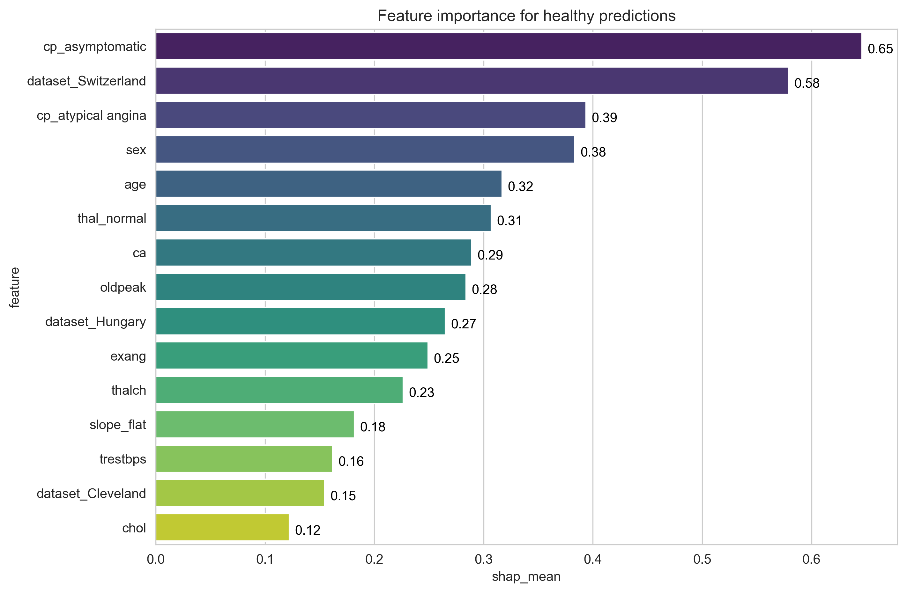
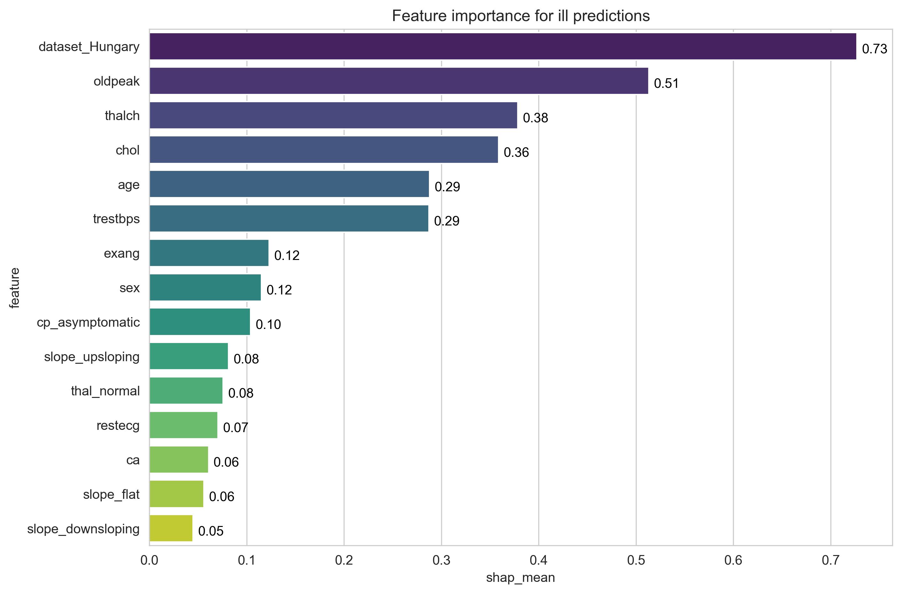

# ❤️ Heart Disease Prediction Project


This project implements an **LGBMClassifier** model to classify heart disease stages from the [UCI Heart Disease Dataset](https://www.kaggle.com/datasets/redwankarimsony/heart-disease-data/data).  
It provides:
- Two Jupyter notebooks for **exploration** and **model training**, one of them is placed on [kaggle](https://www.kaggle.com/code/nadiakachurynets/heart-disease-prediction)
- A simple user-friendly **CLI tool** for inference

---

## 📌 Table of Contents
- [Overview](#-overview)
- [Findings](#-findings)
- [Environment Setup](#️-environment-setup)
- [Dependencies](#-dependencies)
- [Usage](#️-usage)
- [Model Interpretation](#-model-interpretation)

---

## 🔎 Overview
The goal of this project is to predict the **stage of heart disease** based on patient attributes and to interpret model results.  

To provide an interactive way of using the model, a **CLI application** was built with preprocessing included. The output is the **predicted probability** of having heart disease.  

The dataset is **multivariate**, containing 14 attributes:  
- Age, Sex, Chest Pain Type, Resting Blood Pressure, Serum Cholesterol  
- Fasting Blood Sugar, Resting ECG Results, Max Heart Rate Achieved  
- Exercise-Induced Angina, ST Depression (`oldpeak`), Slope of Peak ST Segment  
- Number of Major Vessels, Thalassemia  

The chosen model is **LightGBM’s LGBMClassifier**, which is efficient for tabular data and handles categorical variables and class imbalance well.  

---

## 📊 Findings
**Results on the whole set after cross-validation:**

| Class | Precision | Recall | F1-score | Support |
|-------|-----------|--------|----------|---------|
| 0 (Healthy)      | 0.836 | 0.766 | 0.799 | 411 |
| 1                | 0.591 | 0.517 | 0.551 | 265 |
| 2                | 0.331 | 0.431 | 0.375 | 109 |
| 3                | 0.277 | 0.383 | 0.322 | 107 |
| 4 (Final stage)  | 0.095 | 0.071 | 0.082 | 28  |
| **Weighted Avg** | **0.618** | **0.589** | **0.600** | **920** |

📌 Observations:
- Best performance on **Class 0 (Healthy)**  
- Weakest on **Class 4 (Final Stage)**, likely due to severe **class imbalance**  

**Confusion Matrix Summary:**

| Actual / Prediction | Predicted Healthy | Predicted Ill |
|---------------------|---------|-----|
| Healthy   | 315 ✅ (True Negative) | 96 ❌ (False Positive) |
| Ill       | 62 ❌ (False Negative) | 447 ✅ (True Positive) |

From these results (binary healthy vs ill classification):  
- **Precision**: 76.6%  
- **Recall**: 83.6%  
- **F1-score**: 79.9%

This shows that the model is reasonably good at detecting ill patients (high recall), while keeping false positives relatively low (high precision).

---

## ⚙️ Environment Setup
This project uses **Conda** for environment management.  

1. Create environment:  
   ```bash
   conda create -n myenv python=3.11
   conda activate myenv
2. Install dependencies:
   ```bash
   pip install -r requirements.txt

---

## 📦 Dependencies
Main libraries used:
- numpy
- pandas
- scikit-learn
- matplotlib
- seaborn
- shap
- lightgbm

---

## ▶️ Usage
Run the CLI with:

   ```bash
   python main.py
   ```

The application will:
1.	Prompt you for patient input data
2.	Preprocess the data
3.	Run inference with the trained model
4.	Show the predicted probability of heart disease

---

## 🧩 Model Interpretation

To better understand which features influence the model’s predictions, SHAP (SHapley Additive exPlanations) was used.  

Below are the feature importance plots for the **Healthy** class (class 0) and the **Ill** class (all other stages grouped). These bar plots highlight the top contributing features for each class.

### 🔹 Feature Importance for Healthy Class


### 🔹 Feature Importance for Ill Class

